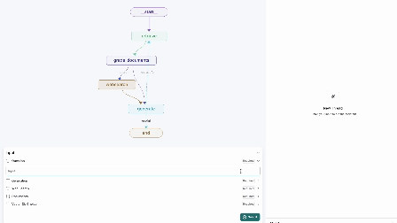

# 04N: Sequence Reconstruction using FMs and RAG

## Project Overview

This project aims to develop a pipeline for the reconstruction of sequential information such as chemical synthesis steps or timeline information using **Foundation Models (FMs)** and **Retrieval Augmented Generation (RAG)**. The project focuses on enabling users to understand the flow of sequential information and quickly identify any gaps in the sequence, specifically targeting domains like chemical synthesis.

**External Industry Client/Advisor**: NVIDIA



## Project Structure

```bash
Deco-3801/
│
├── myenv/
├── src/
│   └── agent/
│       ├── .env
│       ├── graph.py
│       ├── frontend.py
|       ├── app.py
│       ├── ingest.py
│       ├── langgraph.json
│       └── requirements.txt
│       ├── styles.css
├── web_scrapers/
└── README.md
```

## Installation

### 1. Set up Virtual Environment

First, create and activate a virtual environment in the root directory:

```bash
cd Deco-3801
python3 -m venv venv (MacOS)
source venv/bin/activate

./venv/Scripts/activate (Windows)
```

### 2. Install Project Dependencies

Navigate to the src/agent directory and install the required dependencies:

```bash
pip install -r .\src\agent\requirements.txt
```

## How to run the Project

### 1. Create a .env file
Create a .env file inside agent

### 2. Add environment variables inside the .env file
```bash
NVIDIA_API_KEY=
TAVILY_API_KEY=
```

create nvidia nim api key by clicking [here](https://build.nvidia.com/explore/discover).

create tavily api key by clicking [here](https://docs.tavily.com/docs/gpt-researcher/getting-started).

### 3. Start the backend server
```bash
python -m .\src\agent\app.py
```

### 4. Start the frontend
open a new terminal
```bash
streamlit run .\src\agent\frontend.py
```


## LangGraph Studio Instructions
While in Beta, LangGraph Studio is available for free to all LangSmith users on any plan tier. Sign up for LangSmith [here](https://smith.langchain.com/).

### 1. Install Docker Desktop
Ensure that Docker Desktop is installed on your machine. You can download and install it from the [official website](https://docs.docker.com/engine/install/).

### 2. Install LangGraph Studio
Download the latest .dmg file of LangGraph Studio by clicking [here](https://langgraph-studio.vercel.app/api/mac/latest).
Currently, only macOS is supported. Also depends on Docker Engine to be running.

### 3. Start LangGraph Studio
Once LangGraph Studio is installed, start it in the Deco-3801/src/agent directory.
